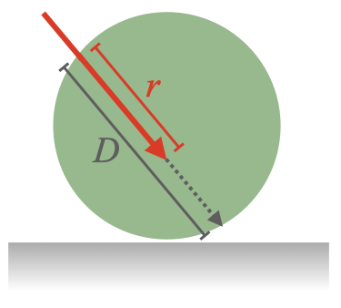
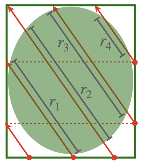
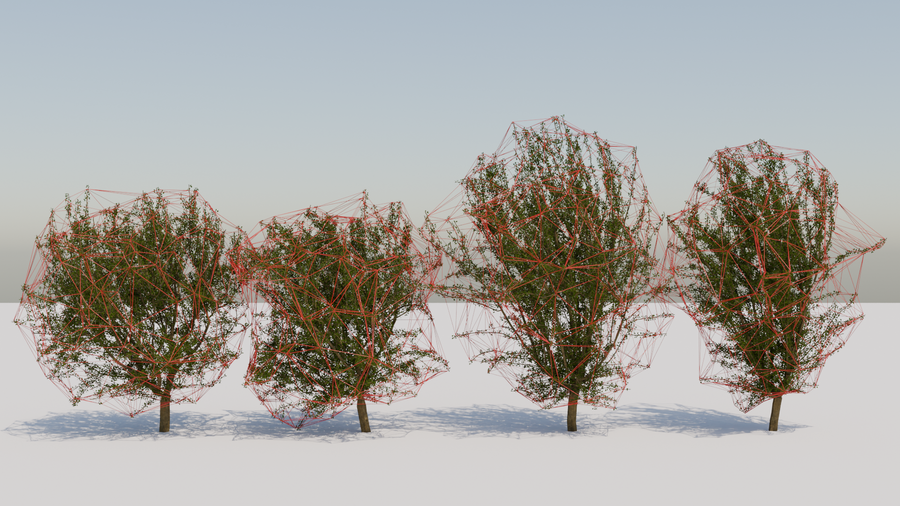

# Calculation of the radiative path length distribution through 3D shapes
### Path length distributions can be calculated for standard shapes of a sphere, ellipsoid, or cone, or based on arbitrary shapes defined by a triangular mesh given in a user-supplied PLY file. 

## Overview

Geometric models of radiation interception in heterogeneous canopies relies on calculation of the probability 
distribution of radiative path length through the plant crown volume.

The path length through a closed 3D volume is the length between the two points of intersection of a line segment 
with the volume boundary, as shown in the schematic below.

<div align="center">
  
</div>

The path length distribution is the probability density function of all possible path lengths through the volume due 
to parallel beams of radiation incident on the volume surface. In this software, the path length distribution is 
calculated by launching a large number of rays from a surface below the volume in the direction of the sun, and 
determining the path length for each beam. Periodic boundaries are used to recycle rays that intersect the boundary 
walls as shown below.

<div align="center">
  
</div>

The program can consider a spherical, ellipsoidal, or conical shape, or an arbitrary shape defined by a triangular 
mesh. The mesh needs to be closed such that a ray entering the volume will intersect the mesh on exit. The figure 
below shows an example of fitting an alpha shape hull to a tree crown geometry. Users should make sure that the mesh 
is not excessively fine, otherwise the calculation will be slow.

<div align="center">
  
</div>

## Usage

### Dependencies

The program is written in Python and requires the following packages: numpy, matplotlib, and trimesh. To install 
dependencies, you can run the following command:

```bash
pip install -r requirements.txt
```

### Calculating path lengths

The main program function is `pathlengths()`, with arguments as described in the table below. Example 
code is given below:

| Parameter       | Description                                                                                                                               |
|-----------------|-------------------------------------------------------------------------------------------------------------------------------------------|
| **shape**       | The geometric shape or object type to analyze. Supported shapes are `"sphere"`, `"ellipsoid"`, `"cone"`, and `"polymesh"`.                |
| **scale_x**     | Scaling factor to apply to the shape in the x-dimension.                                                                                  |
| **scale_y**     | Scaling factor to apply to the shape in the y-dimension.                                                                                  |
| **scale_z**     | Scaling factor to apply to the shape in the z-dimension.                                                                                  |
| **ray_zenith**  | The zenith angle (in degrees) for the rays.                                                                                               |
| **ray_azimuth** | The azimuth angle (in degrees) for the rays.                                                                                              |
| **nrays**       | The number of rays to launch. Each ray is a statistical sample in the distribution.                                                       |
| **plyfile**     | *(Optional)* Path to a PLY file containing the shape geometry. This parameter is only used if the parameter `shape` is set to `polymesh`. |
| **outputfile**  | *(Optional)* Write computed path lengths to specified file.                                                                               |

```python
import pathlengthdistribution as pld

distribution = pld.pathlengths(
    shape='sphere',    
    scale_x=10.0,
    scale_y=10.0,
    scale_z=10.0,
    ray_zenith=45.0,
    ray_azimuth=90.0,
    nrays=5000
)
```

The output `distribution` is a numpy array containing the path length for each ray that intersected the volume.

To use a custom shape defined by a PLY file, set the `shape` parameter to `"polymesh"` and provide the path to the .
ply file in the `plyfile` parameter.

```python
import pathlengthdistribution as pld

distribution = pld.pathlengths(
    shape='polymesh',    
    scale_x=10.0,
    scale_y=10.0,
    scale_z=10.0,
    ray_zenith=45.0,
    ray_azimuth=90.0,
    nrays=5000,
    plyfile='PLY/sphere.ply'
)
```

The above code should produce the same result as the first example, but using a custom shape defined by the PLY file.

### Calculating the path length probability distribution

The function `pathlengthdistribution()` calls the function `pathlengths()` and uses it to calculate the probability 
distribution from the path lengths. The function has the following arguments:

| Parameter       | Description                                                                                                                       |
|-----------------|-----------------------------------------------------------------------------------------------------------------------------------|
| **shape**       | The geometric shape or object type to analyze. Supported shapes are `"sphere"`, `"ellipsoid"`, `"cone"`, and `"polymesh"`.        |
| **scale_x**     | Scaling factor to apply to the shape in the x-dimension.                                                                          |
| **scale_y**     | Scaling factor to apply to the shape in the y-dimension.                                                                          |
| **scale_z**     | Scaling factor to apply to the shape in the z-dimension.                                                                          |
| **ray_zenith**  | The zenith angle (in degrees) for the rays.                                                                                       |
| **ray_azimuth** | The azimuth angle (in degrees) for the rays.                                                                                      |
| **nrays**       | The number of rays to launch. Each ray is a statistical sample in the distribution.                                               |
| **plyfile**     | *(Optional)* Path to a PLY file containing the shape geometry. This parameter is only used if the parameter `shape` is set to `polymesh`. |
| **bins**        | *(Optional; default = 10)* Number of discrete bins for the calculated distribution.                                               |
| **normalize**   | *(Optional; default = True)* Normalize the distribution to sum to 1. If false, the output will be a histogram.                    |

```python
import pathlengthdistribution as pld

distribution = pld.pathlengthdistribution(
    shape='sphere',    
    scale_x=10.0,
    scale_y=10.0,
    scale_z=10.0,
    ray_zenith=45.0,
    ray_azimuth=90.0,
    nrays=5000,
    bins=15
)
```


## License

Licensed under the <a href="LICENSE.md">MIT License</a>.


<div align="center">
  
</div>