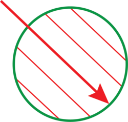
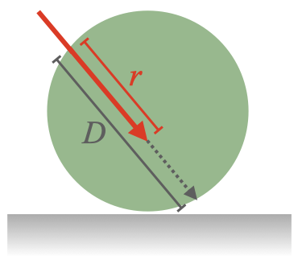
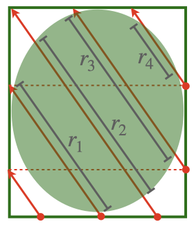
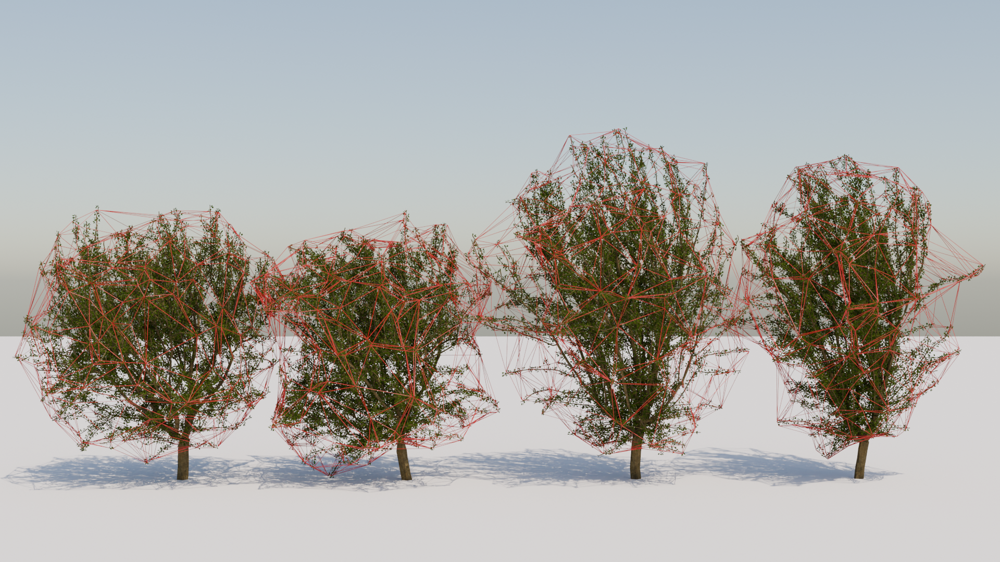

<div align="center">
  
</div>

# Geometric radiation interception, absorption, and path-length distributions in plant canopies
### Computes radiative path-length distributions through plant crowns and, from them, the geometric radiation interception, sunlit fraction, scattering/absorption, and diffuse-radiation quantities for canopies of ellipsoidal, cylindrical, prismatic, or arbitrary mesh-defined crowns. Usable from a desktop GUI or as a Python library.

## Quick start

**Just want to run it?** Launch the graphical interface — enter a few crown/canopy inputs, press
**Run model**, and read the fraction of light the canopy intercepts straight off the top of the
window:

```bash
pip install -r requirements.txt
python pathlength_ui.py
```

(On macOS you need a Python with Tk 8.6+; see [Graphical interface](#graphical-interface) for the
one-line check and the fix if the window opens blank.)

**Prefer to script it?** Import the module and call it directly:

```python
import pathlengthdistribution as pld

# Fraction of incident light an ellipsoidal-crown orchard row intercepts.
P = pld.canopy_interception(
    Gtheta=0.5, LAD=1.0, shape='ellipsoid',
    scale_x=3.0, scale_y=5.0, scale_z=6.0,
    ray_zenith=30.0, ray_azimuth=0.0, nrays=5000,
    sr=6.0, sp=4.0, degrees=True)
print(P)
```

See [Usage](#usage) for the full set of functions (path-length distributions, crown/canopy
interception, sunlit fraction, three-mode scattering/absorption, and diffuse radiation).

## Overview

Geometric models of radiation interception in heterogeneous canopies rely on the probability
distribution of radiative path length through the plant crown volume. This software computes that
distribution and builds the downstream geometric radiation quantities on top of it: per-crown and
canopy-level interception, the sunlit leaf-area fraction, absorbed shortwave via a three-mode
scattering model, and hemispherically-integrated diffuse interception (Bailey et al. 2020; Ponce de
León et al. 2025, 2026).

The path length through a closed 3D volume is the length between the two points of intersection of a line segment 
with the volume boundary, as shown in the schematic below.

<div align="center">
  
</div>

The path length distribution is the probability density function of all possible path lengths through the volume due 
to parallel beams of radiation incident on the volume surface. In this software, the path length distribution is 
calculated by launching a large number of rays from a surface below the volume in the direction of the sun, and 
determining the path length for each beam. Periodic boundaries are used to recycle rays that intersect the boundary 
walls as shown below.

<div align="center">
  
</div>

The program can consider an ellipsoidal (a sphere when all diameters are equal), cylindrical, or rectangular-prism 
crown, or an arbitrary shape defined by a triangular mesh. The mesh needs to be closed such that a ray entering the 
volume will intersect the mesh on exit. The figure 
below shows an example of fitting an alpha shape hull to a tree crown geometry. Users should make sure that the mesh 
is not excessively fine, otherwise the calculation will be slow.

<div align="center">
  
</div>

## Usage

There are two ways to use this software:

* **Graphical interface** — run the desktop app (`pathlength_ui.py`) to enter inputs, run the
  model, and view the path-length distribution and interception results without writing any code.
  See [Graphical interface](#graphical-interface).
* **As a library** — `import pathlengthdistribution` in your own Python script and call its
  functions directly. See [Calculating path lengths](#calculating-path-lengths) and the sections
  that follow.

Both use the same underlying model and the same dependencies below.

### Dependencies

The program is written in Python and requires the following packages: `numpy`, `plyfile`, `numba` (for the
JIT-accelerated ray-tracing kernels), `scipy` (for the diffuse-radiation quadrature), and `matplotlib`
(for the plot in the graphical interface). To install dependencies, you can run the following command:

```bash
pip install -r requirements.txt
```

To also install the test dependencies (`pytest`):

```bash
pip install -r requirements-dev.txt
```

### Units and shape names

* Ray angles (`ray_zenith`, `ray_azimuth`) are in **radians** by default. Pass `degrees=True` to any of the
  public functions to supply them in degrees instead.
* Supported `shape` values are `"ellipsoid"` (a sphere when all scales are equal; alias `"sphere"`),
  `"cylinder"`, `"prism"` (rectangular prism), and `"polymesh"` (triangular mesh from a PLY file; alias
  `"cone"`, which requires a PLY file since there is no analytic cone primitive).

### Performance

The ray-marching and ray/triangle intersection kernels are JIT-compiled with `numba`, giving roughly a
100x–800x speedup on triangular-mesh (`polymesh`) geometry versus the original pure-Python implementation.
The first call in a session pays a one-time compilation cost; subsequent calls run at near-native speed.

### Calculating path lengths

The main program function is `pathlengths()`, with arguments as described in the table below. Example 
code is given below:

| Parameter       | Description                                                                                                                               |
|-----------------|-------------------------------------------------------------------------------------------------------------------------------------------|
| **shape**       | The geometric shape to analyze. Supported: `"ellipsoid"` (alias `"sphere"`), `"cylinder"`, `"prism"`, and `"polymesh"` (alias `"cone"`).  |
| **scale_x**     | Scaling factor to apply to the shape in the x-dimension.                                                                                  |
| **scale_y**     | Scaling factor to apply to the shape in the y-dimension.                                                                                  |
| **scale_z**     | Scaling factor to apply to the shape in the z-dimension.                                                                                  |
| **ray_zenith**  | The zenith angle for the rays (radians by default; `degrees=True` for degrees).                                                                                               |
| **ray_azimuth** | The azimuth angle for the rays (radians by default; `degrees=True` for degrees).                                                                                              |
| **nrays**       | The number of rays to launch. Each ray is a statistical sample in the distribution.                                                       |
| **plyfile**     | *(Optional)* Path to a PLY file containing the shape geometry. This parameter is only used if the parameter `shape` is set to `polymesh`. |
| **outputfile**  | *(Optional)* Write computed path lengths to specified file.                                                                               |

```python
import pathlengthdistribution as pld

distribution = pld.pathlengths(
    shape='sphere',    
    scale_x=10.0,
    scale_y=10.0,
    scale_z=10.0,
    ray_zenith=45.0,
    ray_azimuth=90.0,
    nrays=5000,
    degrees=True
)
```

The output `distribution` is a numpy array containing the path length for each ray that intersected the volume.

To use a custom shape defined by a PLY file, set the `shape` parameter to `"polymesh"` and provide the path to the
PLY file in the `plyfile` parameter. The PLY mesh must be closed and composed of triangular faces.

```python
import pathlengthdistribution as pld

distribution = pld.pathlengths(
    shape='polymesh',    
    scale_x=10.0,
    scale_y=10.0,
    scale_z=10.0,
    ray_zenith=45.0,
    ray_azimuth=90.0,
    nrays=5000,
    plyfile='PLY/sphere.ply',
    degrees=True
)
```

The above code should produce the same result as the first example, but using a custom shape defined by the PLY file.

### Calculating the path length probability distribution

The function `pathlengthdistribution()` calls the function `pathlengths()` and uses it to calculate the probability 
distribution from the path lengths. The function has the following arguments:

| Parameter       | Description                                                                                                                       |
|-----------------|-----------------------------------------------------------------------------------------------------------------------------------|
| **shape**       | The geometric shape to analyze. Supported: `"ellipsoid"` (alias `"sphere"`), `"cylinder"`, `"prism"`, `"polymesh"` (alias `"cone"`). |
| **scale_x**     | Scaling factor to apply to the shape in the x-dimension.                                                                          |
| **scale_y**     | Scaling factor to apply to the shape in the y-dimension.                                                                          |
| **scale_z**     | Scaling factor to apply to the shape in the z-dimension.                                                                          |
| **ray_zenith**  | The zenith angle for the rays (radians by default; `degrees=True` for degrees).                                                                                       |
| **ray_azimuth** | The azimuth angle for the rays (radians by default; `degrees=True` for degrees).                                                                                      |
| **nrays**       | The number of rays to launch. Each ray is a statistical sample in the distribution.                                               |
| **plyfile**     | *(Optional)* Path to a PLY file containing the shape geometry. This parameter is only used if the parameter `shape` is set to `polymesh`. |
| **bins**        | *(Optional; default = 10)* Number of discrete bins for the calculated distribution.                                               |
| **normalize**   | *(Optional; default = True)* Normalize the distribution to sum to 1. If false, the output will be a histogram.                    |

```python
import pathlengthdistribution as pld

distribution = pld.pathlengthdistribution(
    shape='sphere',    
    scale_x=10.0,
    scale_y=10.0,
    scale_z=10.0,
    ray_zenith=45.0,
    ray_azimuth=90.0,
    nrays=5000,
    bins=15,
    degrees=True
)
```

### Radiation interception and absorption

Beyond the path-length distribution itself, the module implements the geometric radiation interception and
absorption models of Bailey et al. (2020, *Geosci. Model Dev.*), Ponce de León et al. (2025, *Agric. For.
Meteorol.*), and Ponce de León et al. (2026, *J. Geophys. Res. Biogeosciences*):

| Function                     | Description                                                                                                                                        |
|------------------------------|--------------------------------------------------------------------------------------------------------------------------------------------------|
| `crown_interception(...)`    | Per-crown probability of intercepting a leaf, `P_leaf = mean[1 - exp(-m·ζ·G·a·r)]`. Supports a path multiplier `m` and leaf absorptivity `ζ`.     |
| `silhouette_area(...)`       | Beam-normal crown silhouette area `S(θ)` (analytic for ellipsoid/cylinder; non-periodic mesh trace for prism/polymesh).                           |
| `canopy_interception(...)`   | Canopy-level binomial interception `P_c` accounting for row geometry (`sr`, `sp`, `φ`) and multiple crown intersections `N_c = S(θ)/S(0)`.        |
| `diffuse_interception(...)`  | Hemispherically-integrated (diffuse) interception via Gauss–Legendre quadrature, with optional anisotropic sky weighting `f_d`.                    |
| `absorbed_fraction(...)`     | Absorbed shortwave fraction via the three-mode scattering model (direct absorption, scattered radiation, ground reflection).                       |
| `crown_sunlit_fraction(...)` | Fraction of crown leaf area that is directly sunlit.                                                                                              |

```python
import numpy as np
import pathlengthdistribution as pld

# Canopy-level absorbed PAR fraction for an ellipsoidal-crown orchard row.
Q = pld.absorbed_fraction(
    LAD=1.0, Gtheta=0.5, shape='ellipsoid',
    scale_x=4.0, scale_y=4.0, scale_z=6.0,
    ray_zenith=30.0, ray_azimuth=0.0, nrays=5000,
    sr=6.0, sp=4.0,              # row / plant spacing
    rho_l=0.09, tau_l=0.04,      # leaf reflectivity / transmissivity (PAR)
    rho_s=0.18,                  # ground reflectivity
    degrees=True,
)
```

## Graphical interface

A desktop GUI (`pathlength_ui.py`) is provided for running the model interactively and viewing the
results without writing any code. It is built with Tkinter (part of the Python standard library)
and embeds a `matplotlib` plot, so it needs a Tk-enabled Python and the `matplotlib` package
(included in `requirements.txt`).

### Launching

Install the dependencies and run the script:

```bash
pip install -r requirements.txt
python pathlength_ui.py
```

> **macOS note — use a Python with Tk 8.6+.** The Tk 8.5.9 that ships with Apple's system /
> Xcode Python 3.9 is broken on modern macOS and renders a **blank window that opens behind other
> apps**. Check your interpreter with
> `python -c "import tkinter; print(tkinter.Tcl().eval('info patchlevel'))"` — if it prints
> `8.5.9`, run the GUI from a Python built against Tk 8.6 instead (a python.org installer, a
> Homebrew `python-tk` build, or a conda env — e.g.
> `conda create -n pld python=3.12 numpy numba scipy matplotlib && conda activate pld && pip install plyfile`).
> Only the GUI needs the newer Tk; the library and test suite work on any supported interpreter.

### Using the window

Fill in the inputs on the left, then press **Run model**. The inputs are grouped into always-shown
sections:

* **Crown Geometry** — crown shape, `scale_x/y/z`, and `nrays`. For the mesh shape a PLY-file field
  and a **Browse…** button appear.
* **Sun direction** — `zenith` and `azimuth`, entered in **degrees**.
* **Distribution discretization** — histogram `bins` and whether to normalize to a probability
  density.
* **Leaf parameters** — `Gtheta` (Ross G) and `LAD` (leaf area density).
* **Canopy configuration** — row spacing `sr`, plant spacing `sp`, and row orientation `phi` (leave
  `phi` blank to use the sun azimuth).

Two optional components have checkboxes that reveal their extra fields:

* **Scattering / absorbed fraction** — leaf/soil optical properties (`rho_l`, `tau_l`, `rho_s`,
  `Q0`) for the three-mode absorbed-fraction model.
* **Diffuse radiation** — hemispherically-integrated interception at the crown or canopy level.

The right-hand panel shows, top to bottom: a **headline banner** with the fraction of incident
light the canopy intercepts (or, when scattering is enabled, the fraction absorbed); a live
**top-down canopy schematic** that previews the crown size, row/plant spacing, and row orientation
against a compass with the sun direction (updated as you type, and drawn in red when crowns would
overlap — see below); the **path-length distribution** plot; and a detailed readout of the
interception fractions, path-length statistics, and silhouette areas. Ray-tracing runs on a
background thread so the window stays responsive; the first run of a session pays the one-time
`numba` JIT compilation cost.

> **Crowns may not overlap.** The model treats each crown as an isolated volume, so the lateral
> crown size must not exceed the spacing: `scale_x ≤ sp` (along-row) and `scale_y ≤ sr`
> (across-row). If you enter a crown larger than its spacing, the schematic draws the crowns
> overlapping in red and warns you; reduce the crown size or increase the spacing.

### Using the model in your own script

For scripting, batch runs, or embedding the model in a larger workflow, skip the GUI and import
the module directly:

```python
import pathlengthdistribution as pld

path_lengths, projected_area = pld.pathlengths(
    shape='sphere', scale_x=10.0, scale_y=10.0, scale_z=10.0,
    ray_zenith=30.0, ray_azimuth=0.0, nrays=5000, degrees=True)
```

The GUI is a thin layer over these functions — every quantity it displays comes from the public
functions documented above ([`pathlengths`](#calculating-path-lengths),
[`pathlengthdistribution`](#calculating-the-path-length-probability-distribution), and the
[interception and absorption functions](#radiation-interception-and-absorption)). `matplotlib` and
Tk are only needed for the GUI; a script that imports `pathlengthdistribution` needs just `numpy`,
`plyfile`, `numba`, and `scipy`.

## Testing

An automated `pytest` suite in `tests/` verifies the models against analytical results — e.g. the triangular
path-length PDF `p(r) = r/(2R²)` of a sphere (mean `4R/3`, max `2R`), the analytic silhouette-area formulas,
the Beer's-law thin-canopy limit, the diffuse-integration identity, and a regression check that the numba
kernels reproduce the pure-Python reference. Run it with:

```bash
pip install -r requirements-dev.txt
pytest
```


## License

Licensed under the <a href="LICENSE.md">MIT License</a>.


<div align="center">
  
</div>